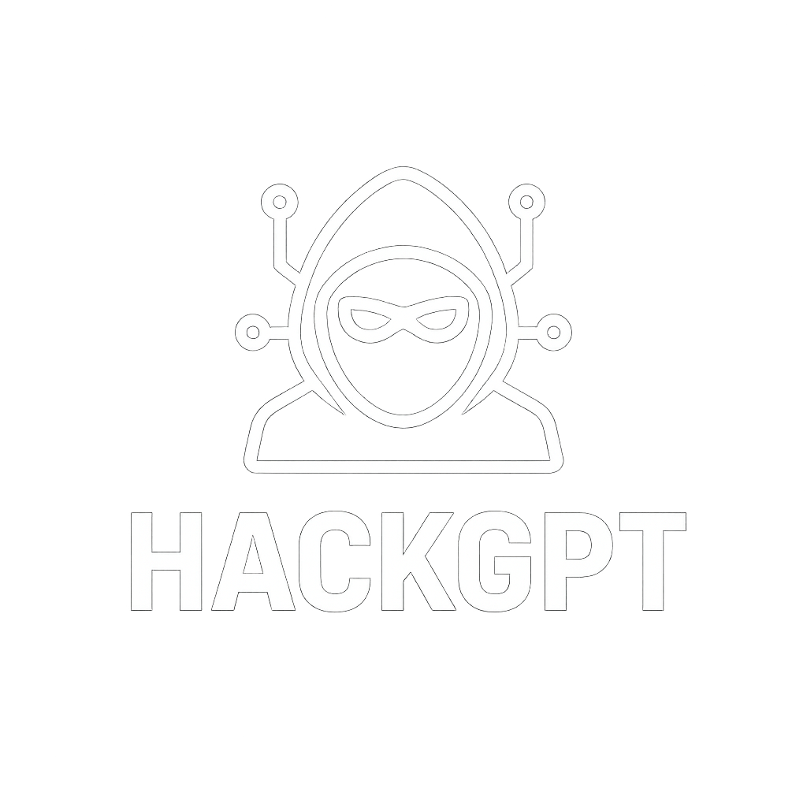

<!-- HackGPT document -->

  

# HackGPT Enterprise Code of Conduct

## 🌟 Our Pledge

In the interest of fostering an open, welcoming, and secure environment, we as contributors and maintainers of **HackGPT Enterprise** pledge to make participation in our project and our community a harassment-free experience for everyone, regardless of age, body size, disability, ethnicity, sex characteristics, gender identity and expression, level of experience, education, socio-economic status, nationality, personal appearance, race, religion, or sexual identity and orientation.

**We are committed to maintaining the highest standards of ethical cybersecurity practices while building an inclusive and collaborative community.**

## 📋 Our Standards

### ✅ Positive Behaviors

Examples of behavior that contributes to creating a positive environment include:

- **Respectful Communication**: Using welcoming and inclusive language in all interactions
- **Ethical Security Practices**: Following responsible disclosure and authorized testing principles
- **Constructive Collaboration**: Being respectful of differing viewpoints and experiences
- **Knowledge Sharing**: Gracefully accepting constructive criticism and sharing expertise
- **Community Focus**: Focusing on what is best for the community and project advancement
- **Professional Conduct**: Showing empathy towards other community members
- **Security Mindset**: Prioritizing security, privacy, and ethical considerations
- **Educational Intent**: Using HackGPT for learning and authorized security assessments only

### ❌ Unacceptable Behaviors

Examples of unacceptable behavior by participants include:

- **Malicious Activities**: Using HackGPT for unauthorized penetration testing or malicious attacks
- **Harassment**: Engaging in trolling, insulting/derogatory comments, and personal or political attacks
- **Privacy Violations**: Publishing others' private information without explicit permission
- **Inappropriate Content**: Sexual language, imagery, or unwelcome sexual attention or advances
- **Illegal Activities**: Using the platform for any illegal cybersecurity activities
- **Unprofessional Conduct**: Other conduct which could reasonably be considered inappropriate in a professional setting
- **Spam/Self-Promotion**: Excessive self-promotion, spam, or off-topic discussions
- **Security Exploitation**: Attempting to exploit vulnerabilities in the project infrastructure

## 🔒 Ethical Cybersecurity Guidelines

As a cybersecurity-focused project, we have additional ethical guidelines:

### 🎯 Authorized Testing Only
- **Permission Required**: Only use HackGPT against systems you own or have explicit written permission to test
- **Legal Compliance**: Follow all applicable laws, regulations, and industry standards
- **Scope Adherence**: Stay within the defined scope of authorized security assessments
- **Documentation**: Maintain proper documentation and audit trails

### 🤝 Responsible Disclosure
- **Vulnerability Reporting**: Report security vulnerabilities through proper channels
- **Coordinated Disclosure**: Allow reasonable time for fixes before public disclosure
- **Community Safety**: Prioritize community and user safety over individual recognition
- **Professional Ethics**: Follow established cybersecurity industry ethical standards

### 📚 Educational Purpose
- **Learning Focus**: Use HackGPT for educational and skill development purposes
- **Knowledge Sharing**: Share knowledge responsibly within the security community
- **Mentorship**: Support newcomers learning ethical hacking and cybersecurity
- **Best Practices**: Promote cybersecurity best practices and awareness

## 🛡️ Enforcement Responsibilities

### Project Maintainers
Project maintainers are responsible for:

- **Standard Clarification**: Clarifying the standards of acceptable behavior
- **Action Taking**: Taking appropriate and fair corrective action in response to unacceptable behavior
- **Content Moderation**: Removing, editing, or rejecting comments, commits, code, issues, and contributions
- **Community Management**: Temporarily or permanently banning contributors for inappropriate behaviors

### Community Leaders
Community leaders have the right and responsibility to:

- **Policy Enforcement**: Remove content that is not aligned with this Code of Conduct
- **Consequence Application**: Apply appropriate consequences for policy violations
- **Education Provision**: Provide guidance and education about acceptable behavior
- **Escalation Management**: Escalate serious violations to appropriate authorities when necessary

## 📞 Reporting Violations

### How to Report
If you experience or witness unacceptable behavior, including violations of cybersecurity ethics, please report it by contacting the project team:

**Primary Contact:**
- **Email**: yashabalam707@gmail.com
- **Subject**: "[HackGPT Code of Conduct] - Brief Description"

**Alternative Contacts:**
- **GitHub Issues**: [Security-related reports](https://github.com/yashab-cyber/HackGPT/issues) (for non-sensitive matters)
- **WhatsApp Business**: [Secure Channel](https://whatsapp.com/channel/0029Vaoa1GfKLaHlL0Kc8k1q)

### What to Include
When reporting, please provide:

- **Detailed Description**: Clear description of the incident or behavior
- **Evidence**: Screenshots, logs, or other relevant evidence (if available)
- **Context**: When and where the incident occurred
- **Impact**: How the behavior affected you or the community
- **Requested Action**: What outcome you're seeking (if any)

### Confidentiality
- All complaints will be reviewed and investigated promptly and fairly
- We will respect the confidentiality and security of the reporter
- Reports will only be shared with necessary personnel for investigation
- Anonymous reporting is accepted and will be investigated to the extent possible

## ⚖️ Enforcement Guidelines

### Response Process
1. **Acknowledgment**: Report acknowledgment within 24-48 hours
2. **Investigation**: Thorough investigation of the reported incident
3. **Assessment**: Determination of appropriate response based on severity
4. **Action**: Implementation of corrective measures
5. **Follow-up**: Monitoring to ensure resolution and prevent recurrence

### Consequences
Community leaders will follow these Community Impact Guidelines in determining the consequences for any action they deem in violation of this Code of Conduct:

#### 1. 📝 Correction
**Community Impact**: Use of inappropriate language or other behavior deemed unprofessional or unwelcome.

**Consequence**: A private, written warning providing clarity around the violation and an explanation of why the behavior was inappropriate. A public or private apology may be requested.

#### 2. ⚠️ Warning
**Community Impact**: A violation through a single incident or series of actions.

**Consequence**: A warning with consequences for continued behavior. No interaction with the people involved for a specified period of time. This includes avoiding interactions in community spaces as well as external channels. Violating these terms may lead to a temporary or permanent ban.

#### 3. ⏱️ Temporary Ban
**Community Impact**: A serious violation of community standards, including sustained inappropriate behavior.

**Consequence**: A temporary ban from any sort of interaction or public communication with the community for a specified period of time. No public or private interaction with the people involved is allowed during this period. Violating these terms may lead to a permanent ban.

#### 4. 🚫 Permanent Ban
**Community Impact**: Demonstrating a pattern of violation of community standards, including sustained inappropriate behavior, harassment, or aggression toward individuals or groups.

**Consequence**: A permanent ban from any sort of public interaction within the community.

#### 5. 🚨 Legal Action
**Community Impact**: Illegal activities, serious security violations, or threats to community safety.

**Consequence**: Immediate permanent ban and potential referral to appropriate law enforcement agencies.

## 🌐 Scope

This Code of Conduct applies within all project spaces and community interactions, including:

- **GitHub Repository**: Issues, pull requests, discussions, and code reviews
- **Communication Channels**: WhatsApp, email, and other official communication
- **Events**: Online and offline events related to the project
- **Social Media**: When representing the project or community
- **Third-Party Platforms**: When discussing or promoting the project elsewhere

The Code of Conduct also applies when an individual is representing the project or its community in public spaces.

## 🔄 Updates and Modifications

This Code of Conduct may be updated periodically to reflect:

- **Community Growth**: Changes needed as the community evolves
- **Legal Requirements**: Updates to comply with applicable laws and regulations
- **Industry Standards**: Alignment with cybersecurity industry best practices
- **Feedback Integration**: Community feedback and suggestions for improvement

**Version**: 1.0  
**Last Updated**: August 18, 2025  
**Next Review**: November 18, 2025

## 📚 Additional Resources

### Cybersecurity Ethics
- [EC-Council Code of Ethics](https://www.eccouncil.org/code-of-ethics/)
- [ISC² Code of Ethics](https://www.isc2.org/Ethics)
- [SANS GIAC Code of Ethics](https://www.giac.org/about/ethics/)

### Community Guidelines
- [GitHub Community Guidelines](https://docs.github.com/en/github/site-policy/github-community-guidelines)
- [Contributor Covenant](https://www.contributor-covenant.org/)
- [Open Source Guide](https://opensource.guide/)

### Legal and Compliance
- [Computer Fraud and Abuse Act](https://en.wikipedia.org/wiki/Computer_Fraud_and_Abuse_Act)
- [Responsible Disclosure Guidelines](https://en.wikipedia.org/wiki/Responsible_disclosure)
- [OWASP Ethical Guidelines](https://owasp.org/)

## 🤝 Attribution

This Code of Conduct is adapted from the [Contributor Covenant](https://www.contributor-covenant.org/), version 2.0, and enhanced with cybersecurity-specific ethical guidelines appropriate for the HackGPT Enterprise project.

---

## 📞 Contact Information

**Project Founder**: Yashab Alam  
**Email**: yashabalam707@gmail.com  
**GitHub**: [@yashab-cyber](https://github.com/yashab-cyber)

For questions about this Code of Conduct, please reach out through any of the contact methods above.

---

*Thank you for helping make HackGPT Enterprise a welcoming, secure, and ethical community for everyone!*

**Made with ❤️ by the HackGPT Enterprise Team**
